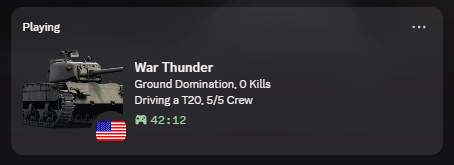

<h1>
  
  War Thunder Discord Rich Presence
</h1>

War Thunder Discord Rich Presence for Windows. The app reads War Thunder's local telemetry on `127.0.0.1:8111` and updates Discord with your current vehicle, map, and match state.

Download the latest `WarThunderRPC_Installer.exe` from GitHub Releases to install it. The repository is mainly for development and building releases.

## Requirements

- Windows
- Python 3.11+

## Features

- Detects whether you are in the hangar, a test drive, or a live match
- Shows the current vehicle and resolves a cleaner display name for many vehicles
- Identifies the current map from War Thunder's local map telemetry
- Tracks simple live match context such as match type and kill count
- Supports both local testing and a packaged Windows `.exe` workflow

Example RPC status:



## Setup

Use the repo-local virtual environment for everything:

### Windows PowerShell

```powershell
python -m venv .venv
.venv\Scripts\Activate.ps1
python -m pip install --upgrade pip
python -m pip install -r requirements.txt
```

### macOS / Linux

```bash
python3 -m venv .venv
source .venv/bin/activate
python -m pip install --upgrade pip
python -m pip install -r requirements.txt
```

These commands are only for managing a Python environment. The packaged app, Windows service integration, and `.exe` build target are Windows-only.

## Build the EXE

### Windows

```powershell
.venv\Scripts\python.exe build.py
```

This produces `dist\WarThunderRPC.exe` and, when Inno Setup is installed, `dist\WarThunderRPC_Installer.exe`.

If you see `Inno Setup compiler not found; runtime EXE was built but installer packaging was skipped.`, install Inno Setup first:

```powershell
winget install JRSoftware.InnoSetup
```

Then restart PowerShell and run the build again.

## Install

### Recommended installer flow

Run the packaged installer:

```powershell
.\dist\WarThunderRPC_Installer.exe
```

The installer will prompt for administrator access because it installs a Windows service and a scheduled task. It will also ask for your War Thunder username, which is used for kill tracking.

### Manual install fallback

If the installer package is not available yet, you can still install from the runtime EXE:

```powershell
.\dist\WarThunderRPC.exe --set-username "YourWarThunderUsername"
.\dist\WarThunderRPC.exe --install-service --runtime-path ".\dist\WarThunderRPC.exe"
```

To remove the service manually:

```powershell
.\dist\WarThunderRPC.exe --uninstall-service
```

## GitHub Releases

Publishing a GitHub Release will trigger the Actions workflow in `.github/workflows/build-release.yml`. It builds the runtime EXE, packages the Windows installer, uploads it as a workflow artifact, and attaches `WarThunderRPC_Installer.exe` to the published release automatically.

## Acknowledgements

Special thanks to [ValerieOSD/WarThunderRPC](https://github.com/ValerieOSD/WarThunderRPC) for the original project and inspiration for this repository.
